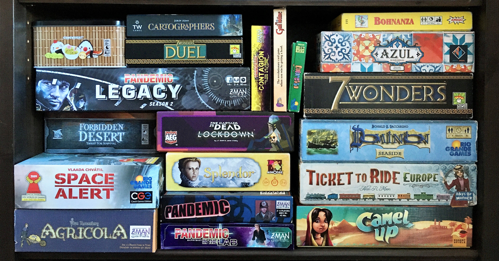
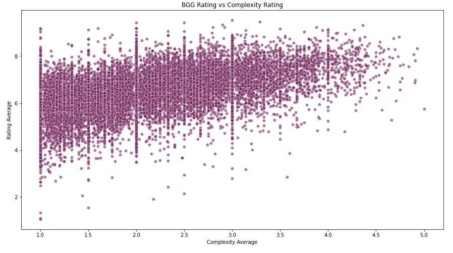
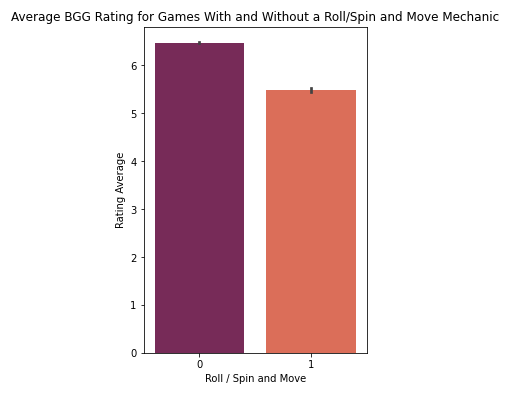
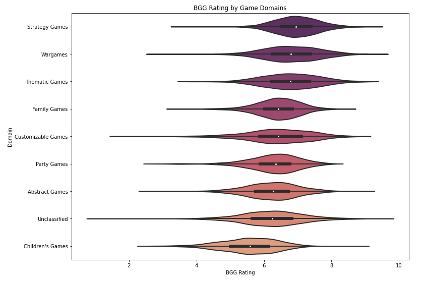

# Board Game Ratings Project

## Introduction

This dataset contains data on board games from the [BoardGameGeek website](https://boardgamegeek.com/) from February 2021. BoardGameGeek (BGG) is an online community dedicated to board games and card games. It has over 2 million registered members who contribute game ratings, reviews, images, and videos.

The dataset contains the following information on over 20,000 board games. This information is supplied by BGG members.
- ID: game id number assigned by BGG
- Name: title of game
- Year Published: year the game was first published
- Min Players: recommended minimum number of players
- Max Players: recommended maximum number of players
- Play Time: average time to play the game
- Min Age: minimum recommended age for the game
- Users Rated: number of BGG users who rated the game
- Rating Average: average rating on a scale of 1-10
- BGG Rank: BGG ranking
- Complexity Average: average complexity rating on a scale from 1 (light) to 5 (heavy)
- Owned Users: number of BGG users who say they own the game
- Mechanics: game mechanics, suggested by BGG users
- Domains: game type, suggested by BGG users

**Sources:**

- [Dataset](https://www.kaggle.com/andrewmvd/board-games) from Kaggle 
- Original author: Dilini Samarasinghe, July 5, 2021, ["BoardGameGeek Dataset on Board Games"](https://ieee-dataport.org/open-access/boardgamegeek-dataset-board-games), IEEE Dataport

### Questions:
- Can we predict a board game’s BoardGameGeek Rating Average based on its characteristics?
- What characteristics of a board game correlate most strongly with its BGG rating?

**Hypothesis:** I am doubtful that there will be a strong correlation between a game's characteristics and its BGG rating because there are so many factors that go into making a good game and many differing tastes and opinions on games. However, I’m interested to see if there are some characteristics that influence the BGG rating more than others.

## Process & Challenges
(See Jupyter Notebook [here].)

Python libraries used: NumPy, Pandas, Seaborn, Matplotlib, Statsmodels

One of the first things I noticed when I took a look at the data was that the `Mechanics` and `Domains` columns contained lists of game mechanics and domains. The biggest challenge of this project was to flatten those lists and use one hot encoding to convert this data into a usable form for a regression model. In addition, there were 183 game mechanics - too many for me to deal with - so I limited it to the 16 mechanics that appeared in over 1000 games.

When I ran summary statistics on my dataframe, I noticed minimum values of 0 that didn’t make sense, for example in `Max Players` and `Play Time`. I concluded that these columns had 0s in place of missing values so I replaced the 0s with NaNs. After checking whether the missing values were biased to the Average Rating or to any particular game domain or mechanic, I decided to remove the rows with missing values. For a deeper look into this process, please see my Jupyter notebook starting [here].

On a side note, my summary statistics also revealed some very interesting outliers in the data. For example, I found that there are games in the BGG database with negative `Year Published`. This refers to ancient games that were first played in years BCE, such as Go and Backgammon! Also, did you know that there are games that take up to 60,000 hours to play? That’s over 40 days!

### Ordinary Least Squares Linear Regression Model

The dependent variable for the regression model is `Rating Average`. I went through three iterations of the regression model:
1.  I used all the other features as independent variables to get a baseline. The Adjusted R-squared value was 0.362, showing a weak correlation. The Prob (F-statistic) was 0.00, showing that the model is legitimately capturing information about the BGG rating. Several of the coefficients had *p*-values above 0.05, meaning that they were not statistically significant.
2.  I removed the nine variables that had a *p*-value above 0.05. The adjusted R-squared value stayed the same, but the model had multicollinearity problems.
3.  I experimented with trying to remove other independent variables that seemed correlated with each other. In the end, I removed two more variables while keeping the adjusted R-squared value at 0.362. There were still multicollinearity issues, but I couldn’t completely fix these without sacrificing the predictive value of the model.

The final linear regression model used the following independent variables to predict the BGG Average Rating: 
- Game Characteristics: Year Published, Min Players, Min Age, Complexity Average, Owned Users
- Game  Mechanics: Area Majority/Influence, Area Movement, Card Drafting, Cooperative Game, Dice Rolling, Hand Management, Hexagon Grid, Roll/Spin and Move, Simulation, Unspecified Mechanics
- Game Domains: Variable Player Powers, Children's Games, Customizable Games, Family Games, Party Games, Thematic Games, Unclassified Games

The model shows a weak correlation (adjusted R-squared = 0.362) between these variables and the Average Rating. The model and all its coefficients are statistically significant.

## Solutions & Analysis

### Can we predict a board game’s BoardGameGeek Rating Average based on its characteristics?

The linear regression model shows that there is a weak correlation between the BGG rating and characteristics of the board games. I wasn’t expecting anything stronger than what I found because of the wide variety in board games and people’s tastes.

### What characteristics of a board game correlate most strongly with its BGG rating?

#### Complexity Rating
The variable that has the strongest positive correlation with the BGG rating is `Complexity Average`. This is a rating of the game’s complexity on a scale of 1 (light) to 5 (heavy). This means that, in general, as a game’s complexity rating goes up, its overall rating also goes up. This result didn’t surprise me: I expect that people who like board games enough to join BoardGameGeek’s online board game community would be experienced board gamers who prefer complex games over simple ones.

#### Game Mechanic: Roll/Spin and Move
The variable with the strongest negative correlation with the BGG rating is `Roll / Spin and Move`. This refers to a game mechanic where players move around the board as a result of a roll of dice or spinning a spinner. Games with this mechanic tended to have lower ratings than those that don’t: on average, they rated about 1 point lower on a scale of 1-10 (see bar graph below). This may be because games with a roll/spin and move mechanic tend to be simpler games that BoardGameGeeks members find less engaging.

#### Ranking Game Domains by Average Rating
Finally, I made a violin plot to show the distribution of BGG ratings for each broad category of game. This chart shows that:
- Strategy Games have the highest average rating. This fits in with the positive correlation between complexity rating and average rating, as strategy games tend to be more complex.
- Children’s Games have the lowest average rating. This is unsurprising since I imagine that few BGG members are children. Children’s games are also more simple.
- Games that are unclassified have the widest spread of ratings.

### Recommendations
For game creators and publishers looking to release the next hot board game among serious board gamers, I suggest the following based on this analysis:
- Create a game that has a fairly high level of complexity. Serious board gamers like to be challenged.
- Strategy games and wargames top the list of game domains. Also consider basing the game around a strong narrative theme.
- Incorporate game mechanics that are more creative than moving around a board based on the result of a spin or dice roll.

### Key Learnings
- My biggest challenge in this project was turning the game domain and mechanics lists into separate columns and one hot encoding them.
- I had to do quite a bit of data cleaning and learned how to decide what to do with missing values.
- I learned how to create, refine and interpret an ordinary least squares linear regression model with statsmodels.
- I learned to manipulate dataframes to make different types of charts with Seaborn.
